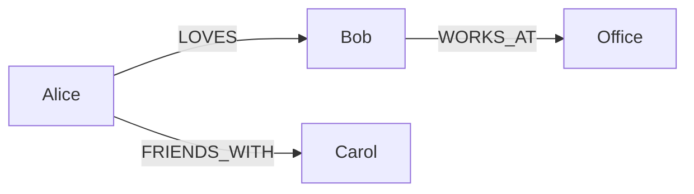
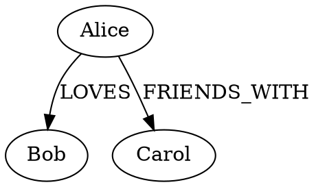

# Echoes MCP Server v6.3 - Advanced Features

## Executive Summary

v6.3 introduces three major features to enhance narrative quality and knowledge graph accuracy:
1. **Timeline Visualization** - Export knowledge graph for visual exploration
2. **Consistency Checker** - Detect narrative inconsistencies (especially kink duplicates)
3. **Human-in-the-Loop** - Review and correct entity/relation extraction

---

## Feature 1: Timeline Visualization

### Problem
The knowledge graph (entities, relations) is stored in LanceDB but not easily explorable. Writers need to visualize character relationships and story structure.

### Solution
Export tools that generate visual representations of the knowledge graph.

### Output Formats

#### Mermaid (markdown-embeddable)


#### JSON (for D3.js/Cytoscape)
```json
{
  "nodes": [
    { "id": "Alice", "type": "CHARACTER", "group": 1 },
    { "id": "Bob", "type": "CHARACTER", "group": 1 },
    { "id": "Office", "type": "LOCATION", "group": 2 }
  ],
  "links": [
    { "source": "Alice", "target": "Bob", "type": "LOVES", "weight": 0.9 }
  ]
}
```

#### DOT (Graphviz)


### MCP Tool

| Tool | Description |
|------|-------------|
| `graph-export` | Export knowledge graph in various formats |

```typescript
// Input
{
  arc: string;              // Required: arc to export
  format: "mermaid" | "json" | "dot";  // Output format
  filter?: {
    entityTypes?: EntityType[];   // Filter by entity type
    relationTypes?: RelationType[]; // Filter by relation type
    characters?: string[];        // Filter by specific characters
  };
}

// Output
{
  format: string;
  content: string;          // The generated graph
  stats: {
    nodes: number;
    edges: number;
  };
}
```

### CLI Command

```bash
# Export full arc graph
echoes graph bloom --format mermaid > bloom-graph.md

# Export only character relationships
echoes graph bloom --format json --entity-types CHARACTER

# Export specific character's network
echoes graph bloom --format dot --characters Alice,Bob
```

### Implementation

```
lib/tools/graph-export.ts
├── buildGraph()           # Query entities/relations from LanceDB
├── filterGraph()          # Apply filters
├── toMermaid()            # Generate Mermaid syntax
├── toJson()               # Generate D3-compatible JSON
└── toDot()                # Generate DOT syntax
```

---

## Feature 2: Consistency Checker

### Problem
Narrative inconsistencies are hard to catch manually:
- **Kink duplicates**: "primo plug" nel capitolo 37 quando già fatto nel capitolo 10
- **Outfit claims**: "non aveva mai indossato una gonna così corta" quando l'ha già fatto
- **First-time claims**: "per la prima volta" nel contenuto quando già successo
- **Relation contradictions**: A loves B in ch3, hates B in ch5 without explanation

### Solution
Automated analysis tool that scans database + content and reports potential issues.

### Data Sources

```yaml
# Frontmatter fields (free text)
outfit: "Nic: Business casual | Vi: Outfit professionale | Angi: Outfit professionale"
outfit: "Ale: Nuda/intimo"
kink: "primo-plug, training-anale, preparazione"
kink: "Ballo sensuale femminile, esibizionismo elegante"

# Content patterns
"per la prima volta", "prima volta che", "mai fatto", "mai indossato", "mai provato"
"first time", "never worn", "never tried", "never done"
```

### Consistency Rules

#### Rule 1: `kink-firsts` - Kink First-Time Tags
Scan `kink` frontmatter field for "first" patterns and find duplicates.

**Patterns detected**:
- `primo-*`, `prima-*`, `first-*`
- `primo bacio`, `prima volta`, `first time`

```typescript
// Example issue
{
  type: "KINK_FIRST_DUPLICATE",
  severity: "warning",
  message: "Kink 'primo-plug' already occurred in earlier chapter",
  current: { arc: "ele", episode: 1, chapter: 37, kink: "primo plug anale" },
  previous: { arc: "ale", episode: 2, chapter: 10, kink: "primo-plug" },
  pattern: "primo-plug"
}
```

**Implementation**:
1. Query all chapters in arc, ordered by episode/chapter
2. Extract kink field, tokenize by comma
3. Find tokens matching `primo|prima|first` patterns
4. Normalize (lowercase, remove accents, stem)
5. Track seen "firsts" and flag duplicates

#### Rule 2: `outfit-claims` - Outfit Contradiction Detection
Scan content for "mai indossato" / "never worn" claims and cross-reference with `outfit` field history.

**Content patterns**:
- "non aveva mai indossato", "mai portato", "prima volta che indossava"
- "never worn", "first time wearing"

```typescript
{
  type: "OUTFIT_CONTRADICTION",
  severity: "warning",
  message: "Claim 'mai indossato minigonna' contradicts previous outfit",
  current: { arc: "work", episode: 2, chapter: 45, claim: "non aveva mai indossato una gonna così corta" },
  previous: { arc: "work", episode: 1, chapter: 12, outfit: "Vi: minigonna nera cortissima" },
  character: "Vi",
  item: "minigonna"
}
```

**Implementation**:
1. Scan content for "mai indossato/portato" + clothing item
2. Extract clothing item (gonna, vestito, top, etc.)
3. Search previous chapters' `outfit` field for same character + item
4. Flag if found

#### Rule 3: `first-time-content` - Content First-Time Claims
Scan chapter content for "prima volta" patterns and detect potential duplicates.

**Content patterns**:
- "per la prima volta", "era la prima volta che", "prima volta nella mia vita"
- "for the first time", "it was the first time"

```typescript
{
  type: "FIRST_TIME_DUPLICATE",
  severity: "info",
  message: "Similar 'first time' claim found in earlier chapter",
  current: { 
    arc: "ale", episode: 3, chapter: 30,
    text: "Per la prima volta da anni, non sto recitando"
  },
  similar: [
    { arc: "ale", episode: 3, chapter: 28, text: "per la prima volta non sto calcolando" },
    { arc: "ale", episode: 3, chapter: 32, text: "per la prima volta da anni" }
  ],
  suggestion: "Review if these 'first time' claims are intentional repetition"
}
```

**Implementation**:
1. Extract sentences containing "prima volta" / "first time"
2. Use embeddings to find semantically similar claims
3. Flag clusters of similar "first time" claims
4. Lower severity (info) because repetition may be intentional (character arc)

#### Rule 4: `relation-jump` - Relation Evolution Gaps
Track relation changes and flag sudden reversals without intermediate chapters.

```typescript
{
  type: "RELATION_JUMP",
  severity: "warning", 
  message: "Relation changed drastically without transition",
  source: "Alice",
  target: "Bob",
  evolution: [
    { chapter: "bloom:ep02:ch001", type: "LOVES", weight: 0.9 },
    { chapter: "bloom:ep02:ch003", type: "HATES", weight: 0.8 }
  ],
  suggestion: "Consider adding transitional chapter"
}
```

**Implementation**:
1. Query relations for arc, group by source+target
2. Sort by chapter order
3. Detect type changes (LOVES→HATES) or weight drops (>0.5 delta)
4. Flag if no intermediate chapter exists

#### Rule 5: `entity-duplicate` - Potential Entity Duplicates
Detect potential duplicate entities using fuzzy matching.

```typescript
{
  type: "ENTITY_DUPLICATE",
  severity: "info",
  message: "Possible duplicate entities detected",
  entities: ["Ale", "Alessandra", "Alexandra"],
  suggestion: "Consider merging or adding aliases"
}
```

**Implementation**:
1. Query all entities in arc
2. Group by Levenshtein distance < 3 or common prefix
3. Flag groups with >1 entity
```

### MCP Tool

| Tool | Description |
|------|-------------|
| `check-consistency` | Analyze arc for narrative inconsistencies |

```typescript
// Input
{
  arc: string;              // Required: arc to check
  rules?: Array<"kink-firsts" | "outfit-claims" | "first-time-content" | "relation-jump" | "entity-duplicate">;
  severity?: "error" | "warning" | "info";  // Minimum severity to report
}

// Output
{
  arc: string;
  issues: Issue[];
  summary: {
    errors: number;
    warnings: number;
    info: number;
  };
}
```

### CLI Command

```bash
# Check entire arc
echoes check bloom

# Check only kink firsts
echoes check bloom --rules kink-firsts

# Check kink and outfit
echoes check bloom --rules kink-firsts,outfit-claims

# Show only errors and warnings
echoes check bloom --severity warning

# Output as JSON for CI integration
echoes check bloom --format json
```

### Implementation

```
lib/tools/consistency/
├── index.ts               # Main checker orchestration
├── rules/
│   ├── kink-firsts.ts     # Kink first-time tag duplicates
│   ├── outfit-claims.ts   # Outfit contradiction detection
│   ├── first-time-content.ts  # Content first-time claims
│   ├── relation-jump.ts   # Relation evolution gaps
│   └── entity-duplicate.ts    # Fuzzy entity matching
├── patterns.ts            # Regex patterns for detection
├── normalize.ts           # Text normalization utilities
└── types.ts               # Issue types and severity
```

### Rule Priority (implementation order)

1. **`kink-firsts`** - Simplest, frontmatter only, high value
2. **`outfit-claims`** - Content + frontmatter, medium complexity
3. **`entity-duplicate`** - DB only, fuzzy matching
4. **`relation-jump`** - DB only, requires ordering logic
5. **`first-time-content`** - Most complex, needs embeddings for similarity

---

## Feature 3: Human-in-the-Loop (HITL)

### Problem
Gemini extraction is good but not perfect:
- Missed entities or relations
- Incorrect entity types
- Wrong relation classifications
- Missing aliases

Currently no way to correct these without re-indexing.

### Solution
A review system that allows humans to validate, correct, and enhance extracted data.

### Workflow

```
┌─────────────────────────────────────────────────────────────┐
│                    EXTRACTION PHASE                         │
├─────────────────────────────────────────────────────────────┤
│  1. Gemini extracts entities/relations                      │
│  2. Results saved to LanceDB with status: "pending"         │
│  3. Generate review file (.echoes-review.yaml)              │
└─────────────────────────────────────────────────────────────┘
                            │
                            ▼
┌─────────────────────────────────────────────────────────────┐
│                    REVIEW PHASE (Human)                     │
├─────────────────────────────────────────────────────────────┤
│  1. Human edits .echoes-review.yaml                         │
│  2. Can: approve, reject, modify, add new                   │
│  3. Run `echoes review apply` to commit changes             │
└─────────────────────────────────────────────────────────────┘
                            │
                            ▼
┌─────────────────────────────────────────────────────────────┐
│                    APPLY PHASE                              │
├─────────────────────────────────────────────────────────────┤
│  1. Parse review file                                       │
│  2. Update LanceDB with corrections                         │
│  3. Mark entities/relations as "reviewed"                   │
│  4. Archive review file                                     │
└─────────────────────────────────────────────────────────────┘
```

### Review File Format

```yaml
# .echoes-review.yaml
# Generated by: echoes index ./content --review
# Arc: bloom
# Generated at: 2024-12-28T15:00:00Z

entities:
  - id: "bloom:CHARACTER:Alice"
    name: "Alice"
    type: "CHARACTER"
    description: "Protagonista principale"
    aliases: ["Ali"]
    status: pending          # pending | approved | rejected | modified
    # Human can change any field and set status to "modified"
    # Or set status to "approved" to accept as-is
    # Or set status to "rejected" to remove

  - id: "bloom:CHARACTER:Roberto"
    name: "Roberto"
    type: "CHARACTER"
    description: "Amico di Alice"
    aliases: []
    status: pending
    # Human adds:
    _correction:
      aliases: ["Rob", "Roby"]
      description: "Migliore amico di Alice, collega di lavoro"

relations:
  - id: "bloom:Alice:LOVES:Roberto"
    source: "Alice"
    target: "Roberto"
    type: "LOVES"
    description: "Alice è innamorata di Roberto"
    weight: 0.8
    chapters: ["bloom:ep01:ch003"]
    status: pending
    # Human correction:
    _correction:
      type: "FRIENDS_WITH"  # Was misclassified!
      weight: 0.9

# Human can also ADD new entities/relations
additions:
  entities:
    - name: "Bar Roma"
      type: "LOCATION"
      description: "Bar dove Alice e Roberto si incontrano"
      aliases: ["il bar", "Bar"]
  
  relations:
    - source: "Alice"
      target: "Bar Roma"
      type: "LOCATED_IN"
      description: "Alice frequenta il Bar Roma"
      chapters: ["bloom:ep01:ch003", "bloom:ep01:ch007"]
```

### MCP Tools

| Tool | Description |
|------|-------------|
| `review-generate` | Generate review file for pending extractions |
| `review-apply` | Apply corrections from review file |
| `review-status` | Show review statistics |

```typescript
// review-generate
{
  arc: string;
  output?: string;          // Output file path (default: .echoes-review.yaml)
  filter?: "pending" | "all";
}

// review-apply
{
  file: string;             // Path to review file
  dryRun?: boolean;         // Preview changes without applying
}

// review-status
{
  arc: string;
}
// Output: { pending: 45, approved: 120, rejected: 3, modified: 12 }
```

### CLI Commands

```bash
# Generate review file after indexing
echoes index ./content --review
# or separately:
echoes review generate bloom

# Check what needs review
echoes review status bloom

# Apply corrections (with preview)
echoes review apply .echoes-review.yaml --dry-run

# Apply corrections
echoes review apply .echoes-review.yaml
```

### Database Schema Extension

```typescript
// Extended entity schema
const EntityRecord = z.object({
  // ... existing fields ...
  
  // HITL fields
  review_status: z.enum(["pending", "approved", "rejected", "modified"]).default("pending"),
  reviewed_at: z.number().nullable(),
  original_extraction: z.string().nullable(),  // JSON of original Gemini output
});

// Extended relation schema  
const RelationRecord = z.object({
  // ... existing fields ...
  
  // HITL fields
  review_status: z.enum(["pending", "approved", "rejected", "modified"]).default("pending"),
  reviewed_at: z.number().nullable(),
  original_extraction: z.string().nullable(),
});
```

### Implementation

```
lib/tools/review/
├── index.ts               # Tool registration
├── generate.ts            # Generate review YAML
├── apply.ts               # Apply corrections
├── status.ts              # Review statistics
└── parser.ts              # YAML parsing with validation
```

---

## Feature 4: Character Arc Tracker

### Problem
Writers need to understand how a character evolves through the story: emotional journey, relationship changes, locations visited. They also need to **consult history before writing** to avoid inconsistencies.

### Solution
A tool that aggregates character data across chapters and presents a coherent evolution timeline, including **kinks** and **outfits** from frontmatter.

### MCP Tool

| Tool | Description |
|------|-------------|
| `history` | Query character/arc history (kinks, outfits, locations, relations) |

```typescript
// Input
{
  arc: string;              // Required: arc to analyze
  character?: string;       // Optional: filter by POV character
  only?: "kinks" | "outfits" | "locations" | "relations";  // Filter by type
  search?: string;          // Search term across all fields
}

// Output
{
  arc: string;
  character?: string;
  kinks: Array<{
    chapter: string;        // "ep01:ch037"
    kink: string;           // "primo plug anale"
    isFirst: boolean;       // true if contains "primo/prima/first"
  }>;
  outfits: Array<{
    chapter: string;
    character: string;      // "Ele" (from parsed outfit field)
    outfit: string;         // "vestito corto modificato"
  }>;
  locations: Array<{
    chapter: string;
    location: string;
  }>;
  relations: Array<{
    chapter: string;
    source: string;
    target: string;
    type: string;
  }>;
}
```

### CLI Command

```bash
# Full arc history
echoes history ele

# Filter by type
echoes history ele --only kinks
echoes history ele --only outfits

# Filter by character (for multi-POV arcs)
echoes history work --character Vi --only outfits

# Search across all fields
echoes history ele --search "plug"
echoes history ele --search "gonna"

# JSON output
echoes history ele --format json
```

### Output Example

```
=== ELE - Arc History ===

🔥 Kinks (chronological):
  ep01:ch011  primo bacio ⭐
  ep01:ch021  senza mutandine
  ep01:ch032  primo squirting ⭐
  ep01:ch037  primo plug anale ⭐
  ep01:ch038  primo anal ⭐
  ep01:ch046  plug anale, rischio pubblico

👗 Outfits:
  ep01:ch009  Ele: gonna nera al ginocchio, camicetta bianca
  ep01:ch015  Ele: gonna grigia + top nero
  ep01:ch037  Ele: vestito corto modificato

📍 Locations:
  ep01:ch001  Casa di Ele
  ep01:ch009  Ufficio
  ep01:ch037  Barcellona - Discoteca
  ep01:ch046  Firenze

💕 Relations (from DB):
  ep01:ch011  Ele → ATTRACTED → Nic
  ep01:ch021  Ele → CONFLICTED → Luca
```

### Use Case: Pre-Writing Check

Before writing a new chapter with "primo X", the writer can:
```bash
echoes history ele --only kinks --search "plug"
# Shows: ep01:ch037 "primo plug anale" ⭐
# Writer knows: "plug anale" already happened, don't use "primo"
```

### Implementation

```
lib/tools/track/
├── index.ts               # Tool registration
├── aggregator.ts          # Query and aggregate data
├── emotional-arc.ts       # Build emotional timeline
├── relationships.ts       # Track relationship evolution
├── locations.ts           # Location history
└── formatter.ts           # CLI output formatting
```

---

## Implementation Plan

### Phase 1: Timeline Visualization
- [ ] Implement graph-export tool
- [ ] Mermaid output format
- [ ] JSON output format (D3-compatible)
- [ ] DOT output format
- [ ] CLI command `echoes graph`
- [ ] Filter options (entity types, characters)
- [ ] Tests

### Phase 2: Consistency Checker
- [x] Implement check-consistency tool base
- [x] Rule: `kink-firsts` (frontmatter first-time tags)
- [x] Rule: `outfit-claims` (content + frontmatter contradictions)
- [x] Rule: `entity-duplicate` (fuzzy entity matching)
- [x] Rule: `relation-jump` (relation evolution gaps)
- [x] Rule: `first-time-content` (content first-time claims with embeddings)
- [x] CLI command `echoes check-consistency`
- [x] JSON output for CI
- [x] Tests

### Phase 3: Human-in-the-Loop
- [ ] Extend database schemas with review fields
- [ ] Implement review-generate tool
- [ ] Implement review-apply tool
- [ ] Implement review-status tool
- [ ] YAML parser with validation
- [ ] CLI commands `echoes review`
- [ ] `--review` flag for index command
- [ ] Tests

### Phase 4: Character Arc Tracker
- [ ] Implement track-character tool
- [ ] Emotional arc aggregation
- [ ] Relationship evolution tracking
- [ ] Location history
- [ ] CLI command `echoes track`
- [ ] ASCII visualization for CLI
- [ ] Tests

---

## Environment Variables

```bash
# Existing
GEMINI_API_KEY=your_api_key
ECHOES_GEMINI_MODEL=gemini-2.5-flash
ECHOES_EMBEDDING_MODEL=Xenova/e5-small-v2

# New (optional)
ECHOES_REVIEW_AUTO=true    # Auto-generate review file on index
```

---

## CLI Summary (v6.3)

```bash
# Existing commands
echoes index ./content [--arc <arc>] [--force] [--review]
echoes search <query> [--arc <arc>] [--type <type>]
echoes stats [--arc <arc>] [--pov <pov>]
echoes words-count <file>

# New commands
echoes graph <arc> --format <mermaid|json|dot> [--entity-types <types>] [--characters <names>]
echoes check <arc> [--rules <rules>] [--severity <level>] [--format <text|json>]
echoes review generate <arc> [--output <file>]
echoes review apply <file> [--dry-run]
echoes review status <arc>
echoes track <character> --arc <arc> [--no-emotions] [--no-relations] [--no-locations] [--format <text|json>]
```

---

## Quality Standards

- **Test coverage**: 100%
- **Type safety**: Strict TypeScript
- **Backward compatible**: Existing databases work without migration
- **Review fields**: Optional, default to "approved" for existing data
